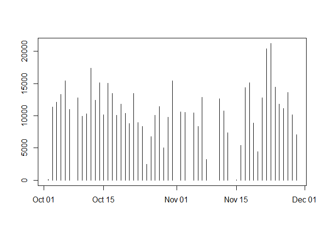

## Loading the data


```r
# Load and read the data
filePath <- "~/RProjects/GIT/RepData_PeerAssessment1/"
activity <- read.csv(paste(filePath,"activity.csv", sep="")) 
```

## Pre-Processing the data


```r
activity <- activity[complete.cases(activity),]
```

## What is mean total number of steps taken per day?


```r
library(dplyr)
```

```
## 
## Attaching package: 'dplyr'
```

```
## The following objects are masked from 'package:stats':
## 
##     filter, lag
```

```
## The following objects are masked from 'package:base':
## 
##     intersect, setdiff, setequal, union
```

```r
# 1. Calculate the total number of steps per day
stepsByDate <- summarise(group_by(activity, date), sum(steps))
stepsByDate
```

```
## # A tibble: 53 x 2
##    date       `sum(steps)`
##    <fct>             <int>
##  1 2012-10-02          126
##  2 2012-10-03        11352
##  3 2012-10-04        12116
##  4 2012-10-05        13294
##  5 2012-10-06        15420
##  6 2012-10-07        11015
##  7 2012-10-09        12811
##  8 2012-10-10         9900
##  9 2012-10-11        10304
## 10 2012-10-12        17382
## # ... with 43 more rows
```

```r
#2. Histogram (Plot) the steps By Date
colnames(stepsByDate)[2] <- "steps"
stepsByDate[,1]<-as.Date(stepsByDate$date)

#Two varieties of plots (Histogram)
#By Summary
hist(stepsByDate$steps, main = "Total Steps/Day", xlab = "Total Steps/Day", col = "green", ylim = c(0,20), breaks = seq(0,25000, by=2500))
```

<!-- -->

```r
#By Date
plot(stepsByDate$date, stepsByDate$steps,type="h",xlab="", ylab="")
```

<!-- -->

```r
#3. Calculate and report the mean and median of the total number of steps taken per day
#mean
meanSumSteps <- mean(stepsByDate$steps)

#median
medianSumSteps <- median(stepsByDate$steps)
```

## What is the average daily activity pattern?


```r
# Make a time series plot (i.e. type = "l") of the 5-minute interval (x-axis) and the average number of steps taken, averaged across all days (y-axis)
avgDailyAct <- aggregate(activity$steps, by=list(activity$interval), FUN=mean, na.rm=TRUE)
colnames(avgDailyAct) <- c("Interval", "Mean")
plot(avgDailyAct$Interval, avgDailyAct$Mean,type="l",xlab="Interval", ylab="Steps", main = "Average Daily Activity Pattern", lwd=2)
```

<!-- -->

```r
#Which 5-minute interval, on average across all the days in the dataset, contains the maximum number of steps?

activity[which.max(activity$steps),]
```

```
##       steps       date interval
## 16492   806 2012-11-27      615
```

## Imputing missing values

```r
#1. Calculate and report the total number of missing values in the dataset (i.e. the total number of rows with NAs)
fullActivity <-read.csv(paste(filePath,"activity.csv", sep=""))
sum(is.na(fullActivity$steps))
```

```
## [1] 2304
```

```r
#2. Devise a strategy for filling in all of the missing values in the dataset. The strategy does not need to be sophisticated. For example, you could use the mean/median for that day, or the mean for that 5-minute interval, etc.
#3.Create a new dataset that is equal to the original dataset but with the missing data filled in.

impActivity <- fullActivity
for (i in 1:nrow(impActivity)){
     if (is.na(impActivity[i,1]))
         for (j in 1:nrow(avgDailyAct))
             if (impActivity[i,3] == avgDailyAct[j,1]) impActivity[i,1] = avgDailyAct[j,2]
}


#4. Make a histogram of the total number of steps taken each day and Calculate and report the mean and median total number of steps taken per day. Do these values differ from the estimates from the first part of the assignment? What is the impact of imputing missing data on the estimates of the total daily number of steps?

#a. Histogram of the total number of steps per day
stepsByDate <- summarise(group_by(impActivity, date), sum(steps))
colnames(stepsByDate)[2] <- "steps"
hist(stepsByDate$steps, col = "green", xlab = "Total Steps/Day", ylim = c(0,30), main = "Total number of Steps/Day", breaks = seq(0,25000,by=2500))
```

<!-- -->

```r
#b. Calculate and report the mean and median total number of steps taken per day 
#mean
meanSumSteps <- mean(stepsByDate$steps)

#median
medianSumSteps <- median(stepsByDate$steps)

#c.  Do these values differ from the estimates from the first part of the assignment?
```

## Are there differences in activity patterns between weekdays and weekends?

```r
for (i in 1:nrow(impActivity)) {
     if ( weekdays(as.Date(impActivity$date[i])) =="Saturday" | 
          weekdays(as.Date(impActivity$date[i]))=="Sunday") impActivity$day[i]="Weekend"
     else impActivity$day[i]="Weekday"
}

activityRollUp <- aggregate(steps~interval + day, impActivity, mean, na.rm = TRUE)

library(ggplot2)

ggplot(activityRollUp, aes(x = interval , y = steps, color = day)) +
       geom_line() +
       labs(title = "Average Steps by Type of Day", x = "Interval", y = "Average Steps") +
       facet_wrap(~day)
```

<!-- -->

